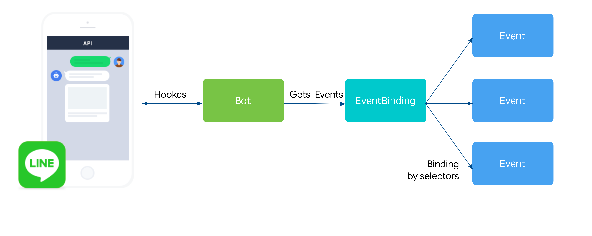

# LINE Bot Operator 
An operator provides LINE bot that makes it easy to deploy on Kubernetes.

## Concepts

This operator has three fundamental concepts:

* **Bot** defines the desired spec of the Bot deployment.
* **Event** defines eventing rules for a bot instance.
* **EventBinding** defines the set of events to be used by the bot. You select Events to be bound using labels and label selectors.